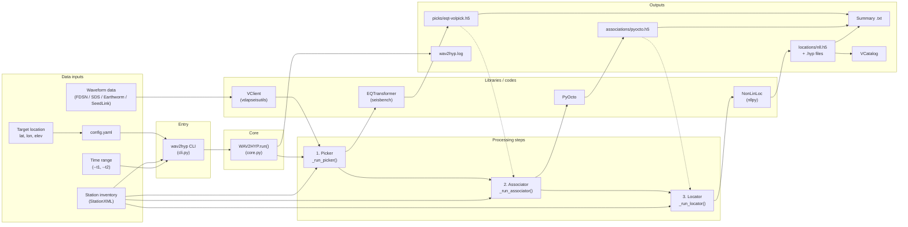
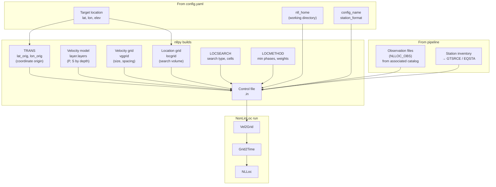

# WAV2HYP Workflow

Waveform-to-hypocenter pipeline: data inputs, processing steps, and outputs.

## Main pipeline flowchart

**Important:** The **target location** (latitude, longitude, elevation) is a key input to `config.yaml` (under `target:`). It defines the study area for association (PyOcto) and the grid origin for location (NonLinLoc via nllpy).

## Inputs to NonLinLoc (parallel view)

NonLinLoc is driven by [nllpy](https://github.com/jwellik/nllpy), which builds the control file and runs Vel2Grid → Grid2Time → NLLoc. All of the following feed into NonLinLoc:

| Input to NonLinLoc | Source | Role |
|--------------------|--------|------|
| **Target location (lat, lon, elev)** | `config.target` | Grid origin in nllpy (`create_volcano_config(lat_orig, lon_orig)`); defines TRANS and grid geometry. |
| **Observation files (NLLOC_OBS)** | Associated catalog | Picks per event; written by `catalog.write_nlloc_obs()`. |
| **Station inventory** | `config.inventory` | Station coordinates and (optionally) phase errors → GTSRCE/EQSTA in control file. |
| **nll_home** | `config.locator.nll_home` | Working directory for control file, grids, and output. |
| **Velocity model** | nllpy template (e.g. volcano) | `config.layer.layers` (depth, Vp, Vs, etc.). |
| **Velocity / location grids** | nllpy template | vggrid, locgrid (size, spacing, origin). |
| **Control file** | nllpy `write_complete_control_file()` | Ties all of the above together; Vel2Grid, Grid2Time, and NLLoc read it. |

## Detailed workflow (left-to-right)

| Stage | Inputs | Code / component | Outputs |
|--------|--------|-------------------|--------|
| **Entry** | `config.yaml`, `--t1`/`--t2`, `-p`/`-a`/`-l`/`--all` | `wav2hyp.cli` → `WAV2HYP(config).run()` | Time chunks, validated config |
| **1. Picker** | Inventory, time range, waveform client config | `VClient` (waveforms), `seisbench.EQTransformer` (annotate), `EQTOutput` | `picks/eqt-volpick.h5`, optional picker summary |
| **2. Associator** | Picks (from step 1 or existing .h5), inventory, associator config | `pyocto.OctoAssociator`, `PyOctoOutput` | `associations/pyocto.h5`, optional associator summary |
| **3. Locator** | Associated catalog (from step 2 or existing .h5), inventory, NLL config | `nllpy` (control file), NonLinLoc (vel2grid, grid2time, NLLoc), `NLLOutput` | `locations/nll.h5`, NLL `.hyp` files, optional locator summary |
| **End** | Located catalog | — | Final `VCatalog`, logs |

## Input summary

- **config.yaml**: **Target location** (`target`: name, **latitude**, **longitude**, **elevation**) is a key input—used for association ROI and for NonLinLoc grid origin via nllpy. Also: `inventory.file`, `waveform_client` (datasource, client_type), `output` (base_dir, dirs, summary filenames), `picker`, `associator`, `locator` sections.
- **Station inventory**: path in config; StationXML format.
- **Waveform data**: accessed via VClient using config (FDSN, SDS path, Earthworm, or SeedLink).
- **Time range**: required for processing; `--t1` and `--t2`.

## Velocity model and NLLPy in config

**Can the user define the velocity model in wav2hyp's config?**  
Yes, in two ways:

1. **`locator.velocity_model_layers`** — Optional. List of layer rows for NonLinLoc. Each row is `[depth_km, VpTop, VpGrad, VsTop, VsGrad, rhoTop, rhoGrad]`. If present, this overrides the default velocity model from nllpy’s volcano template.
2. **`locator.nllpy_overrides`** — Optional. Dict of options passed through to the nllpy config after the volcano template is applied. Use nested keys for sub-objects (e.g. `locgrid: { d_grid_x: 0.2, d_grid_y: 0.2 }`, or `layer: { layers: [...] }`). This lets you change grids, search, location method, phase IDs, etc., without changing nllpy code.

**Associator velocity** (used only for PyOcto association, not for NonLinLoc) is set in `associator.p_velocity` and `associator.s_velocity`.

**Can the user define inputs for NLLPy?**  
Yes. wav2hyp passes to nllpy:

- From config: **target** (lat, lon) → `create_volcano_config(lat_orig, lon_orig)`, plus `nll_home`, `config_name`, `station_format`, `run_vel2grid`, `run_grid2time`.
- Optional: **`velocity_model_layers`** and **`nllpy_overrides`** (see above). Any other nllpy/NLLoc settings can be overridden via `nllpy_overrides` if the corresponding config attribute exists on nllpy’s `NLLocConfig` (e.g. `locgrid`, `vggrid`, `locsearch`, `locmethod`, `layer`).

## Output summary

- **Picker**: `{base_dir}/{picker_dir}/eqt-volpick.h5` (picks + detections); optional `picker_summary` .txt.
- **Associator**: `{base_dir}/{associator_dir}/pyocto.h5` (events + assignments); optional `associator_summary` .txt.
- **Locator**: `{base_dir}/{locator_dir}/nll.h5` (catalog), plus NonLinLoc `.hyp` under `nll_dir`; optional `locator_summary` .txt.
- **Logs**: `{base_dir}/{log_dir}/wav2hyp.log`.
- **In-memory**: final `vdapseisutils.VCatalog` returned by `run()`.
